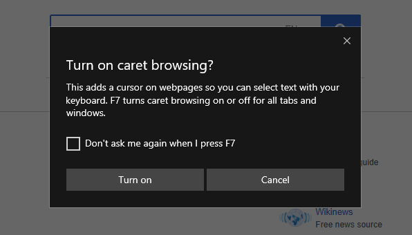
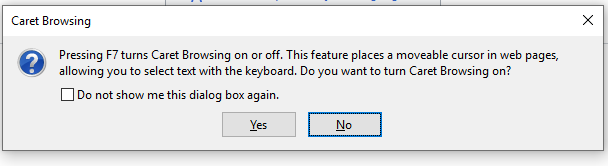

# Native Caret Browsing Support Explainer

Disclaimer: this document is not a proposal to introduce a new set or to edit an existing set of JavaScript APIs but rather to explain a problem that we would like to solve in Chromium project.

## Introduction
Caret Browsing is an accessibility feature for navigating through the web content in the browser with keyboard navigation keys such as arrow keys, CTRL, SHIFT and other keys. Besides accessibility scenarios, caret browsing can also unblock users that do not have a mouse, or any other technology that would enable mouse-like behavior. In this case,  the absense of caret browsing would cause limited user expereience and in some cases no ability at all to select page contents or navigate through text nodes in page elements.

The behavior is as if the content was set to document.designMode = ‘on’ with the difference that the user is not able to actually edit non-editable elements.

In Chromium, users can download caret browsing [extension](https://chrome.google.com/webstore/detail/caret-browsing/fklpgenihifpccgiifchnihilipmbffg) from Chrome’s Web Store. The are two problems with existing approach. 
First, extensions are not always available for use in some organizations due to enterprise policies, in cases when users navigate the web in “Incognito” mode, or when Guest profile is used. Second, extensions may be more difficult to be discovered or that it may take too many steps to enable the desired behavior. This is especially true for people with limited abilities or those who are not accustomed to be using keyboard in the absense of a mouse.

To elaborate on the first problem with extension-powered caret browsing is that some Enterprises do not allow installing extensions. A good example of such a case can be seen [here](https://bugs.chromium.org/p/chromium/issues/detail?id=611798&q=caret%20browsing&colspec=ID%20Pri%20M%20Stars%20ReleaseBlock%20Component%20Status%20Owner%20Summary%20OS%20Modified). A bug opened on Chromium by a consortium of Canadian banks where they seem restrict or block access to extensions.

Use cases with Incognito mode and Guest profile would also lack support for caret browsing completely, thus, making browsing experience effectively unusable.
Discoverability of the extension also lacks user friendliness. In order to install caret browsing extension today, you must navigate to the Accessibility section in the Settings page, follow the link to the Extensions Store where you can download the extension, restart the browser, and finally, use caret browsing. This may be perceived as bad user experience, especially by persons with disabilities. 

## Solutions
One of the possible solutions to this problem could be native support of Caret Browsing. This is how this feature is currently implemented in Edge and Firefox.
We propose to implement a way for users to enable caret browsing through pressing F7 and confirming on a subsequently shown dialog. Below are few examples of how this is implemented in other browsers.

Caret Browsing in Edge:

Caret Browsing in Firefox:

In some cases, function keys may not be available and so alternative shortcuts would be needed.
For example, keyboard layout on Mac is inconsistent. Some keyboards have an F7 key, some have FN + F7 keys, and some have the function key space customized. While ideally we would want to keep the user experience consistent across platforms, it is not always easy to do. The alternative shortcut for Mac could be a new shortcut combination: CMD + Option + 7. 

High-Level Overview of the implementation can be found (here)[].

## Usage
It is worth mentioning the Caret Browsing usage. The data in Edge showed small usage. Usage for the month of June across all releases of Edge appeared to be .0044%. That said, Caret Browsing will be broken completely for a vulnerable minority in the contexts that were mentioned above. 
