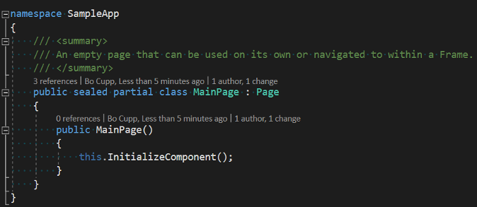
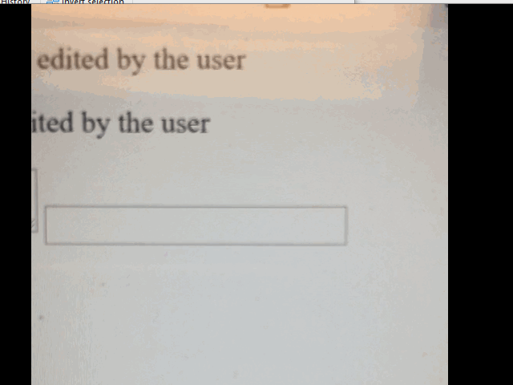

# EditContext API Explained
This document proposes a new API for integrating web applications with the input services of an operating system to allow clean separation of document object model and data model.

## Motivation:
The built-in edit controls of the browser are no longer sufficient as the editing experience has evolved from filling in form data to rich editing experiences in web applications like CKEditor, GSuite, TinyMCE, Office 365, Visual Studio Online and others.

Contenteditable, the most recent editing innovation developed as part of HTML5, was meant to provide a new editing primitive suitable for building rich editing experiences, but came with a design flaw in that it couples the document model and view.  As a result, contenteditable is only suitable for editing HTML in a WYSIWYG fashion, and doesn't meet the needs of many editing applications.

Despite their shortcomings, contenteditable and the good old textarea element are used by many web-based editors today, as **without a focused, editable element in the DOM, there is no way for an author to leverage the advanced input features of modern operating systems including composition, handwriting recognition, shape-writing, and more**.

Each approach comes with its own set of drawbacks that include
1. Contenteditable approach limits the app's ability to enhance the view, as the view (i.e. the DOM) is also the authoritative source on the contents of the document being edited.
1. Additional issue with using contenteditable is that the editing operations built-in to the browser are designed to edit HTML, which produces results that are unrelated to the change in the actual editable document.  For example, shown in "Use Cases" section below, typing an 'x' after keyword `public` in the document when using a contenteditable element would continue with the preceding blue color making "publicx" look like a keyword. To avoid the issue, authors may prevent the default handling of input (e.g. on keydown). This can be done, but only for regular keyboard input and when a composition is not in progress, specifically, **there is no way to prevent modification of the DOM during composition without  disabling composition**.
1. In textarea approach, native selection cannot be used as part of the view (because its being used in the hidden textarea instead), which adds complexity (since the editing app must now build its own representation of selection and the caret), and (unless rebuilt by the editing app) eliminates specialized experiences for touch where selection handles and other affordances can be supplied for a better editing experience.
1. When the location of selection in the textarea doesn't perfectly match the location of selection in the view, it creates problems when software keyboards attempt to reposition the viewport to where the system thinks editing is occurring.  Input method-specific UI meant to be positioned nearby the selection, for example the UI presenting candidates for phonetically composed text, can also be negatively impacted (in that they will be placed not nearby the composed text in the view).
1. Accessibility is negatively impacted. Assistive technologies may highlight the textarea to visually indicate what content the assisted experience applies to. Given that the textarea is likely hidden and not part of the view, these visual indicators will likely appear in the wrong location.  Beyond highlighting, the model for accessibility should often match the view and not the portion of the document copied into a textarea. For assistive technology that reads the text of the document, the wrong content may be read as a result.

**To summarize, EditContext API will help reduce code complexity in JavaScript editors by decoupling view and data model in a browser which in turn will increase developer productivity. This API will also resolve a number of composition scenarios. e.g., long running composition in collaboration scenarios.**


## Goals:
The goal of the EditContext is to expose the lower-level APIs ptovided by modern operating systems to facilitate various input modalities to unlock advanced editing scenarios.

## Non-Goals:
EditContext API does not intend to replace existing edit controls that can still be used for simple editing scenarios on the web.

### Use cases
#### Editing in online code editor:
Visual Studio editing experience.  This would be difficult to replicate on the web using a contenteditable element as the view contains more information that the plain-text document being edited. Specifically, the grey text shows commit history and dependency information that is not part of the plain-text C# document being edited. Because input methods query for the text of the document nearby the selection for context, e.g. to provide suggestions, the divergence in document content and presentation can negatively impact the editing experience. 



#### Native selection gripper support
Below the two animated gifs contrast the experience touching the screen to place a caret for Visual Studio Online (uses a hidden textarea for input and recreates its own selection and caret), versus placing a caret in a contenteditable div in Chrome (grippers shown).

|  No grippers  | Native Grippers    |
| ------------- | ------------------ |
|   |  |


## Proposal:
To avoid the side-effects that come from using editable elements to integrate with input services, we propose using a new object, EditContext, that when created provides a connection to the operating system's input services.

The EditContext is an abstraction over a shared, plain-text input buffer that provides the underlying platform with a view of the content being edited. Creating an EditContext conceptually tells the browser to instantiate the appropriate machinery to create a target for text input operations. In addition to maintaining a shared buffer, the EditContext also has the notion of selection, expressed as offsets into the buffer, state to describe layout of bounds of the view of the editable region, as well as the bounds of the selection. These values are provided in JavaScript to the EditContext and communicated by the browser to the underlying platform to enable rich input experiences.

Having a shared buffer and selection for the underlying platform allows it to provide input methods with context regarding the contents being edited, for example, to enable better suggestions while typing. Because the buffer and selection are stateful, updating the contents of the buffer is a cooperative process between the characters coming from user input and changes to the content that are driven by other events. Cooperation takes place through a series of events dispatched on the EditContext to the web application &mdash; these events are requests from the underlying platform to read or update the text of the web application. The web application can also proactively communicate changes in its text to the underlying platform by using methods on the EditContext.

A web application is free to create multiple EditContexts if there are multiple distinct editable areas in the application.  Only the focused EditContext (designated by calling the focus method on the EditContext object) receives updates from the system's input services.  Note that the concept of the EditContext being focused is separate from that of the document's activeElement which will continue to determine the target for dispatching keyboard events.

While an EditContext is active, the text services framework may read the following state:
* Text content
* Selection offsets into the text content
* The location (on the screen) of selection
* The location (on the screen) of the content this EditContext represents

The text services framework can also request that the buffer or view of the application be modified by requesting that:
* The text contents be updated
* The selection of be relocated
* The text contents be marked over a particular range, for example to indicate visually where composition is occurring

The web application is free to communicate before, after or during a request from the underlying platform that its:
* Text content has changed
* Selection offsets have changed
* The location (on the screen) of selection or content has changed
* The preferred mode of input has changed, for example, to provide software keyboard specialization 

[API usage examples](examples.md)

## Alternatives:
Multiple approaches have been discussed during F2F editing meetings and through online discussions.
* New `ContentEditable` attributes. The group has [considered](https://w3c.github.io/editing/contentEditable.html) adding new attribute values to contenteditable (events, caret, typing) that in would allow web authors to prevent certain input types or to modify some input before it has made it into the markup. This approach hasn’t gotten much traction since browsers would still be building these behaviors on top of content editable thus, inheriting existing limitations.
 
* `beforeInput` event. It eventually diverged into two different specs, [Level 1](https://www.w3.org/TR/input-events-1/) (Blink implementation) and [Level 2](https://www.w3.org/TR/input-events-2/) (Webkit implementation). The idea behind this event was to allow developer to preventDefault user input (except for IME cases) and provide information about the type of the input. Due to Android IME constraints, Blink made most of the `beforeInput` event types non-cancelable except for a few formatting input types. This divergence would only get worse over time and since it only solves a small subset of problems for the web, it can’t be considered as a long-term solution.

* As an alternative to `beforeInput` Google has proposed a roadmap in [Google Chrome Roadmap Proposal](https://docs.google.com/document/d/10qltJUVg1-Rlnbjc6RH8WnngpJptMEj-tyrvIZBPSfY/edit) where it was proposed to use existing browser primitives solving CE problems with textarea buffer approach, similar to what developers have already been doing. While we agree with it in concept, we don't think there is a clean way to solve this with existing primitives. Hence, we are proposing EditContext API.

# Backup Material

[Dev Design](dev-design.md)

## Open Issues

How to deal with EditContext focus when the focused element itself is editable? In the current proposed model, the focused element doesn't receive things like composition events &mdash; should an editable element receive these? It feels like we should treat these the same as when the text input operations are redirected and not deliver those events to the editable element.

Is there a reason we might want to fire keypress on the focused element for non-IME input to EditContext. I couldn't think of one and this is generally a synthesized event anyways.

How does EditContext integrate with accessibility [Accessibility Object Model?](http://wicg.github.io/aom/explainer.html) so that screen readers also have context as to where the caret/selection is placed as well as the surrounding contents. This is another major complaint about implementing editors today - without a contenteditable with a full fidelity view, the default accessibility implementations report incorrect information.

Additionally, how can we provide better guidance around accessibility w.r.t. to the `textformatupdate` event.

It feels like we may need a mechanism by which ```layoutChanged()``` is more easily integrated. Currently there is no single point that the web developer knows it may need to report updated bounds, and the current model may encourage layout thrashing by computing bounds early in the process of producing a frame. Instead we may need to provide a callback during the rendering steps where the EditContext owner can set the updated layout bounds themselves. Perhaps IntersectionObservers is a good model where we can queue a microtask that will fire after the frame has been committed and layout has been computed &mdash; the layout update may be delayed by a frame, but the update is asynchronous anyways.


#### What services do editable elements provide?
* Integrate with focus so keyboard, composition, clipboard and other ambient input events have a sensible place to be routed
* Integrate with the browser's native selection so the user can express where editing operations should occur
    * This includes displaying a caret to mark an insertion point for text
    * Includes implementing boundaries for selection so that it doesn't extend across the boundary of an editable element.
* Editable elements participate in the view such that they have a size and position known to the browser for themselves and their contents
* Provide editing operations that are specific to the type of editable element.
* Describe themselves to the OS input services:
    * To indicate if a specialized software keyboard could be used to facilitate input.
    * To enable composition and other forms of input like handwriting recognition and shape-writing.
    * To communicate position information so specialized UI for input can be displayed nearby editable regions and software keyboards can scroll the viewport to avoid occluding the editable area.
    * To provide a plain-text view of the document for context so that suggestions for auto-completion, spell-checking, and other services can be effectively provided.
* Handle specialized input requests from the OS
    * To highlight text to, for example, indicate where composition is occurring
    * Replace arbitrary runs of text to, for example, facilitate composition updates, provide auto-correction, and other services.
    * Change the location of selection or the caret.
    * Blur to lose focus.
* Describe themselves to accessibility services in a special way to indicate that they are editable regions of the document.
* Enable clipboard operations
* Automatically become a drop target
* Undo Manager that maintains the stack of user actions.

#### If we build an editor without editable elements, i.e. using the DOM to render the view of the editable document, what are we missing?
* APIs to manage focus exist and can be applied to elements that are not editable.
* Size and position can be computed for elements in the view that represent the editable document. APIs exist so this information can be queried and fulfill requests for accessibility and the OS input services if new APIs were created to communicate with those services.
* We lose the ability receive OS input-oriented requests.  An API is needed to replace this.
* We lose edit pattern support for accessibility.  An API is needed to replace this.
* To compensate for the loss of caret the editing app must provide its own and may also provide its own selection.
* APIs exist to register parts of the view as a drop target
* Clipboard events will still fire on paste even when the area is not editable, but the editing app must take actions on its own.
* The app must implement its own Undo Manager.

#### Lower-level APIs provided by modern operating systems
* To facilitate input using a variety of modalities, OSX, iOS, Android, Windows, and others have developed a stateful intermediary that sits between input clients (e.g. IMEs) and input consumers (i.e. an editing app).
* This intermediary asks the editing app to produce an array-like, plain-text view of its document and allows various input clients to query for that text, for example, to increase the accuracy of suggestions while typing.  It also can request that regions of the document be highlighted or updated to facilitate composition.  It also can request the location of arbitrary parts of the document so that the UI can be augmented with input-client specific UI.
* Browsers take advantage of these OS input services whenever an editable element is focused by registering for callbacks to handle the requests to highlight or update the content of the DOM and to fulfill the queries mentioned above.

#### Links to Relevant operating systems input APIs
| Operating System |    |
| ---------------- | -- |
| Android | [InputMethodManager](https://developer.android.com/reference/android/view/inputmethod/InputMethodManager) |
| OS X | [Implementing Text Input Support](https://developer.apple.com/library/archive/documentation/TextFonts/Conceptual/CocoaTextArchitecture/TextEditing/TextEditing.html#//apple_ref/doc/uid/TP40009459-CH3-SW25) |
| iOS | [Communicating with the Text Input System](https://developer.apple.com/library/archive/documentation/StringsTextFonts/Conceptual/TextAndWebiPhoneOS/LowerLevelText-HandlingTechnologies/LowerLevelText-HandlingTechnologies.html#//apple_ref/doc/uid/TP40009542-CH15-SW16) |
| Linux | [Intelligent Input Bus (IBus) ](https://github.com/ibus/ibus/wiki)
| Windows | [Text Services Framework](https://docs.microsoft.com/en-us/windows/desktop/TSF/text-services-framework) |