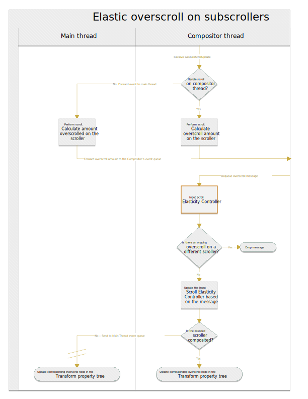

# Elastic overscroll on subscrollers
Author: [Matt Amert](https://github.com/maamert)

## Overview

1. The first part of the diagram is the same as it is today; on a Gesture Scroll Update (GSU), either the main thread or the compositor thread will handle it, though it will always go through the compositor thread first. The only difference is that any overscroll, regardless of if it's the root, will generate overscroll information.
    With BGPT, there is a stable mapping of Transform property node IDs between the two threads, and will be used to identify which transform node to associate with the overscroll info.
2. This information is sent to the compositor event queue, where the InputScrollElasticityController will use it to update its internal state. Nothing in InputScrollElasticityController will need to change. However, if there is currently an ongoing overscroll already, this message will get dropped.
    Having only one overscroll happen at the same time is reasonable, as it is very difficult to ever have more than one scroller overscrolled at a given time, and reduces complexity.
3. If the targetted scroller is composited, we can directly set the corresponding overscroll node in the Compositor's version of the Transform property tree. If it isn't, we will have to forward the message to the main thread so it can update its version of the property tree.

Note that this change will require adding an additional Transform node to Blink's transform property tree:

  [ PaintOffsetTranslation ]

  [ StickyTranslation ]

  [ Transform ]

  [ Perspective ]

  [ ElasticOverscroll ] <--- Adding (Will only be present when ScrollTranslation is also present)

  [ ReplacedContentTransform ] OR [ ScrollTranslation ]

  [ TransformIsolationNode ]

With BGPT, this means that a transform node will also be created in cc's transform property tree as well.

## Open Questions:

1. How and where do we factor things like Overscroll Behavior and Overscroll Customization into this design?
2. How do we handle the case where we have to demote a scroller from composited to non-composited? (How is it handled today?)
3. With BGPT, theoretically the compositor has access to all of the Transform property tree nodes, even if the correlating nodes are not composited. Could we therefore just bypass sending the message to the main thread, and instead just set it on the compositor? It wouldn't get to the main thread until a commit happens, but maybe this is fine?
4. How will hit-testing factor into this? (How does hittesting work today? It doesn't use the Transform property tree, as I've verified by experiment).
5. With this change, can we remove the root's elastic overscroll transform node in Visual Viewport, or will this cause problems?
