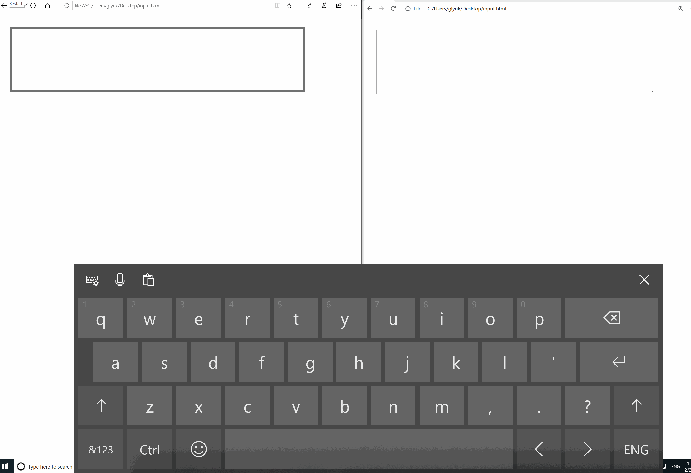

# Streamlining Text Input in Touch Keyboard and IMEs Through TSF1
## Introduction/Motivation
The Input Method Editor (IME) was originally intended to be used for typing languages whose glyphs were not present on user keyboards.
With the rise of smartphones and devices with touch screens, customers depend on IMEs even more. In the absence of hardware keyboards, text input for all languages is entered through a Soft Input Panel (SIP), i.e., virtual keyboard which is powered by the IME.
Advanced typing scenarios began to surface as IMEs became more popular. To streamline text input in IMEs, new text “intelligence services” emerged providing features such as autocorrection, suggestions, shapewriting, IME reconversion (after the composition has ended) and other input modalities.
Text intelligence services are available in Windows and on mobile platforms such as Android and iOS. However, not all apps on Windows get these services automatically; apps using the IMM32 must specifically enable text intelligence services to light-up the new streamlined text input for users. This includes Chromium-based apps. 
As it stands today, users of Chromium-based browsers are not able to enjoy text intelligence services that Windows Input services provides today. The following gif showcases one example of suggestions and shapewriting features being present in Edge with TSF1 stack (left) vs Chrome with IMM32 stack (right).




This proposal addresses the following use-cases:
* Text intelligence - Suggestions appear on the SIP as you type. User can select the suggestions to insert them in edit controls.
* Swipe keyboard – User can use shapewriting to input text.
* Reconversion after commit – for languages which support reconversion, user can select the committed text and reconvert it.
## Goals
Provide Chromium-based browsers with context-rich IME powered-typing experience by taking advantage of Input services’ text intelligent features, starting from Windows 7 release and up.
## Non-Goals
It is a non-goal to completely replace existing IMM32 on Windows as it is still used by some third party plugins.
This proposal is not aiming to address SIP issues on other platforms. We are building plans about long-term IMM32 suport once we land TSF1.
## Solution
The missing features described in the introduction should be addressed by implementing Text Services Framework (TSF1.0).
Chromium team has made some progress on [this already](https://bugs.chromium.org/p/chromium/issues/detail?id=657623) and the solution is aligned with our proposal.
TSF1.0 is shipped on Windows Desktop starting from version 7 and up, which naturally becomes a preferred option since it covers most Windows versions that are still in use.
## Alternatives Considered
Windows Input stack has since evolved from TSF1.0 into what is called a TSF3.0<sup>[1](#tsf3footnote1today)</sup>. We considered TSF3.0 as an alternative but leaned towards TSF1.0 for few reasons.
TSF3.0 is a distilled version of TSF1.0 which was packaged in a clean API surface. 
High level, there were couple of engineering pros that TSF3.0 offers:
* Simpler API programming model with support for multiple languages.
* TSF3.0 exposes ```InputPanelDisplayPolicy``` which allows the control of SIP policy to be either Manual or Automatic.

One of the main cons was the fact that TSF3.0 APIs are accessed through WinRT layer which is not available on Windows down-level.
Having two different input stacks for Windows seemed excessive and would potentially add an unjustified level of complexity to Chromium.
Given this information we concluded that TSF3.0 doesn't provide any additional value to Chromium when compared to TSF1.0.

<a name="tsf3footnote1">1</a>: TSF2.0, a precursor to TSF3.0 which was used on non-desktop versions of Windows, which was eventually replaced by TSF3.0. Starting from Spring of 2017 TSF3.0 version has been unified on desktop and non-desktop versions of Windows. 
