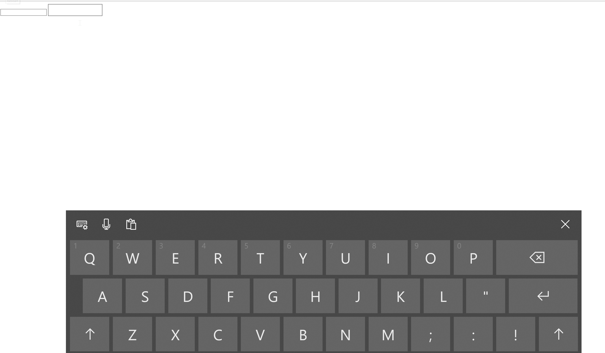
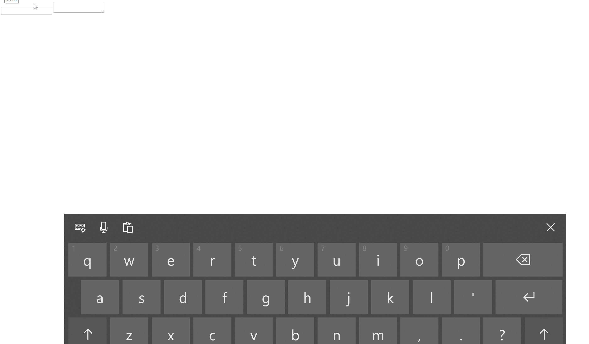

# Streamlining Text Input in IMEs

Authors: [Amit Jain](amitja@microsoft.com) | [Grisha Lyukshin](https://github.com/gked)

Disclaimer: this explainer is not a proposal to introduce a new set or to edit an existing set of JavaScript APIs but rather a proposal for integrating TSFS1.0 into Chromium for better IME support and Soft Keyboard experiences on Windows.

## Introduction/Motivation
The Input Method Editor (IME) was originally intended to be used for typing languages whose glyphs were not present on user keyboards.
With the rise of smartphones and devices with touch screens, customers depend on IMEs even more. In the absence of hardware keyboards, text input for all languages is entered through a Soft Input Panel (SIP), i.e., virtual keyboard which is powered by the IME.

Advanced typing scenarios began to surface as IMEs became more popular. To streamline text input in IMEs, new text “intelligence services” emerged providing features such as autocorrection, suggestions, shapewriting, IME reconversion (after the composition has ended) and other input modalities.

Text intelligence services are available in Windows and on popular mobile platforms such as Android. However, not all apps on Windows get these services automatically; apps using the legacy input stack must specifically enable text intelligence services to light-up the new streamlined text input for users. This includes Chromium-based apps. 

As it stands today, users of Chromium-based browsers are not able to enjoy text intelligence services that Windows Input services provides today. The following gifs showcase one example of suggestions and shapewriting features being present in Edge vs Chrome.

Streamlined text input in Edge: 

Chrome (using legacy input stack on Windows desktop):

This proposal addresses the following use-cases:
* Text intelligence - Suggestions appear on the SIP as you type. User can select the suggestions to insert them in edit controls.
* Swipe keyboard – User can use shapewriting to input text.
* Speech input – User can use speech to input text.
* Reconversion after commit – for languages which support reconversion, user can select the committed text and reconvert it.

## Goals
Provide Chromium-based browsers with context-rich IME powered-typing experience by taking advantage of Input services’ text intelligent features, starting from Windows 7 release and beyond.

## Non-Goals
It is a non-goal to completely replace existing legacy input stack on Windows as it is still used by some third party plugins.

## Solution
The missing features described in the introduction should be addressed by implementing Text Services Framework (TSF1.0) in Chromium. TSF1.0 is currently shipped on Windows Desktop starting from version 7 and up. TSF1.0 implementation provides access to platform’s text intelligence services that will streamline typing experience in IME.

## Alternatives
Input stack has since evolved from TSF1.0 into what it is called a TSF3.0[1](#tsf3footnote1today).

Another alternative we considered was implementing TSF3.0 in Chromium. The problem, however, was that it is not supported on earlier versions of Windows. TSF3.0 became available in 1703 (RS2) and beyond. To avoid having two different versions of TFS implemented, the decision was made to stay with TSF1.0 model.

<a name="tsf3footnote1">1</a>: TSF2.0, a precursor to TSF3.0 was an in-between versions framework that was only used in non-desktop versions of Windows, which was essentially replaced by TSF3.0. Starting from Spring of 2017 TSF3.0 version has been unified on desktop and non-desktop versions of Windows. 
